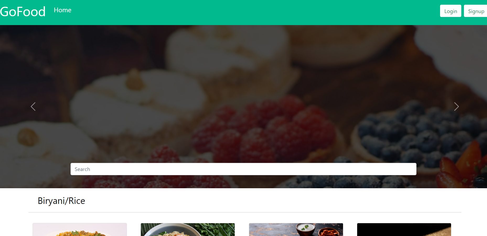
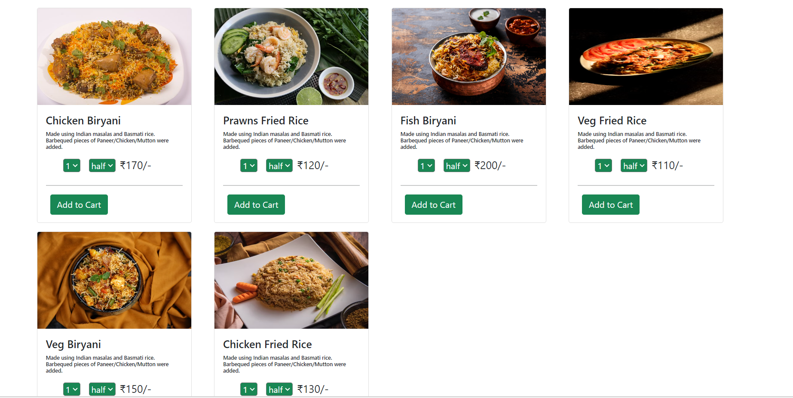
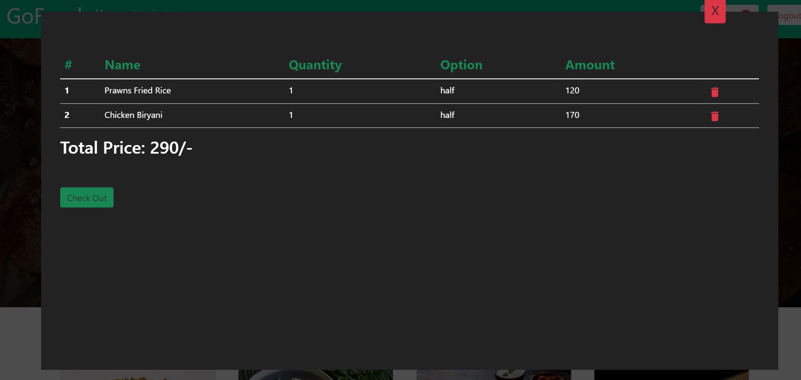

# Food Delivery App

Food Delivery App is a web application that allows users to browse and search for food items, add them to their cart, and place orders. The application is built using React for the front end, Node.js and Express for the back end, and MongoDB for the database. Redux is used for state management.

## Features

- **Search for Food**: Users can search for various food items based on their preferences.
- **Add to Cart**: Users can add food items to their cart for easy checkout.
- **Place Orders**: Users can place orders for the selected food items.

## Tech Stack

- **React**: A popular JavaScript library for building user interfaces.
- **Redux**: A predictable state container for JavaScript apps, used for managing the application's state.
- **Node.js**: A JavaScript runtime built on Chrome's V8 JavaScript engine, used for building scalable network applications.
- **Express.js**: A fast, unopinionated, and minimalist web framework for Node.js, used for building web applications and APIs.
- **MongoDB**: A widely-used NoSQL database, used for storing and managing application data.

## Installation

Make sure you have Node.js and npm (or Yarn) installed.

1. Clone the repository:
   ```sh
   git clone https://github.com/[YOUR_USERNAME]/food-delivery-app.git
   cd food-delivery-app


### Screenshots

<div style="float: left;padding: 5px;margin: 5px">
  
  
  

</div>

<br>
